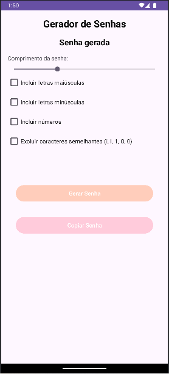

<h1 align="center">Calculadora</h1>

## Project
This project is a password generator app developed in Android Studio with Kotlin. The app allows users to create secure, customizable passwords by choosing specific options such as uppercase and lowercase letters, numbers, special characters, and password length. It includes features for excluding similar characters to improve readability and a button to easily copy the generated password. This app is designed to promote strong password practices while offering flexibility and ease of use.

## Layout
<div align="center">
  
</div>

## Technologies Used
- *Programming Language:* Kotlin
- *Development Environment:* Android Studio

## Code Author
```kotlin
fun main() {
    println("Code by Marcela Geremias!")
}